# Portal Wallet - Investor Demo

Hi potential Investor! We've made a quick demo of Portal for you.

**You can use this to send real money to identified recipients anywhere in the world instantly.**

## Installing the extension

Normally Portal is installed through the Chrome Web Store (or Edge Web Store etc). But for this demo we'll install it outside the store.

Download and unzip the the file provided.

Then in Chrome, click the three dot menu **⋮** then **Manage Extensions**:

Turn on **Developer Mode**

Now click **Load unpacked**

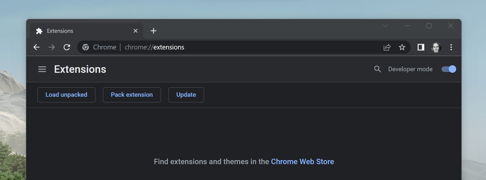

Select the folder:

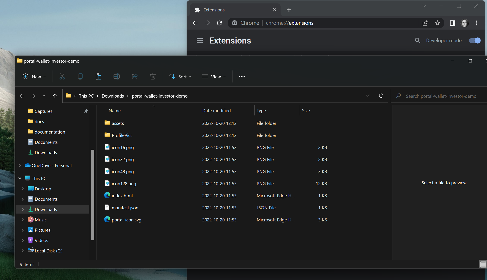

Now the extension is loaded:

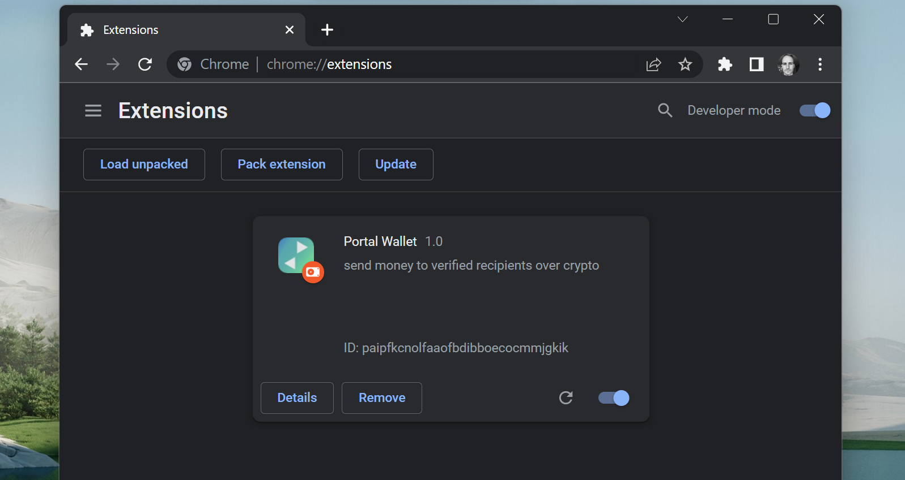

Now click the puzzle piece 🧩 icon and Pin the Portal:

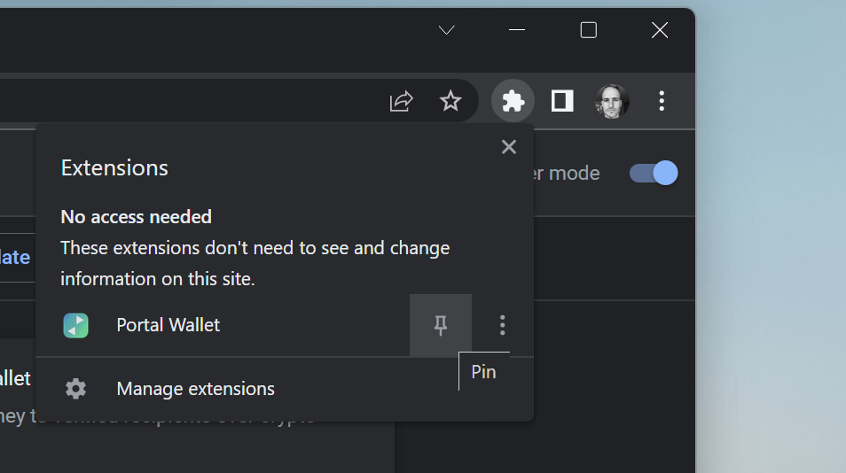

You can now open Portal:

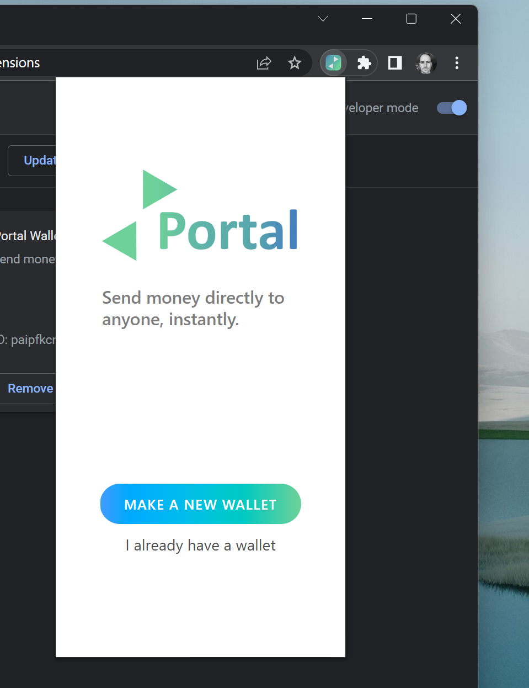

## Onboarding

We have made a demo wallet for John Testuser that's already signed in and verified. Normally, users go through a regular Onfido government-supplied ID check as part of signup, to get verified, we've saved you the time for this demo!

To use this, pick **I already have a wallet**. Use the secret key `2okr45A8i762cCetGmUVuAcozTzzpPQhtEw8vFzeTCzLCpQwtiJFq2Woog7hyRoeoufhch6g2rax1yojL3ryBwHe`:

Use any password you like:

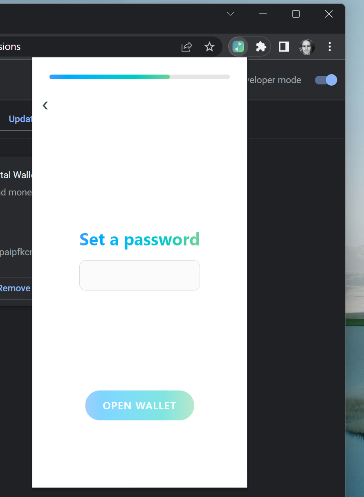

The wallet is now ready.

## Sending money

The account has **$10.00 real USDC**, and you can **send the money anywhere you want**.

- Someone online says they're your friend Vaheh says `6PCANXw778iMrBzLUVK4c9q6Xc2X9oRUCvLoa4tfsLWG` is their Solana account. Let's find out if this is true! Try sending to that address.

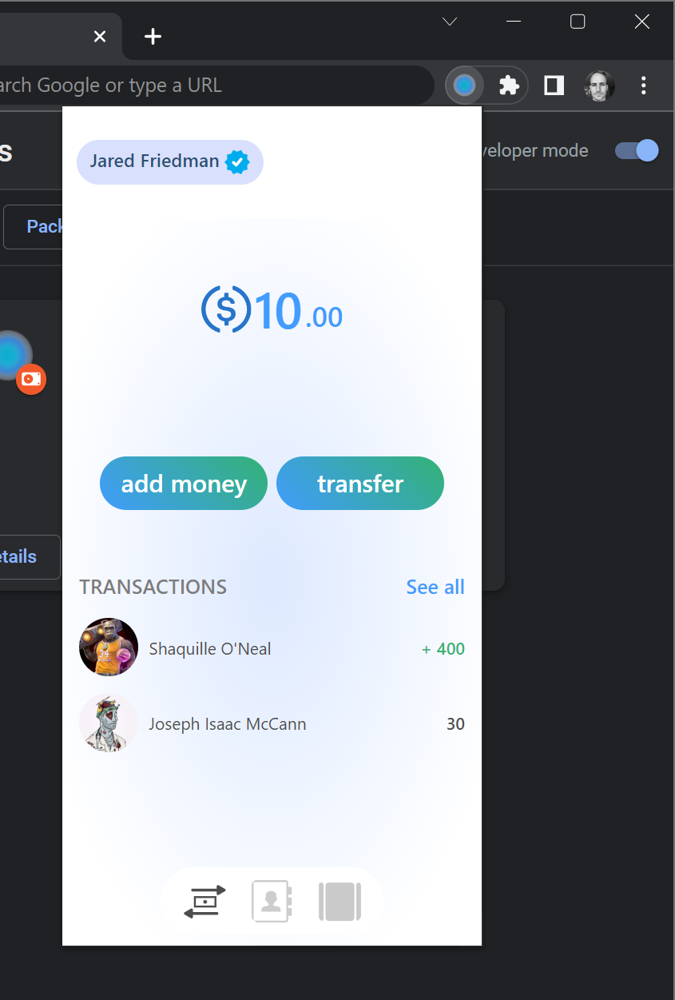

You can send USDC to Vaheh's wallet, and know it's really him, entirely on the block chain.

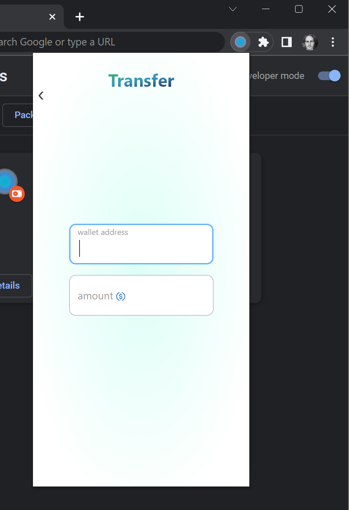
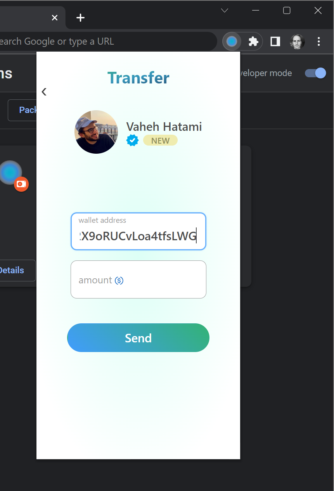
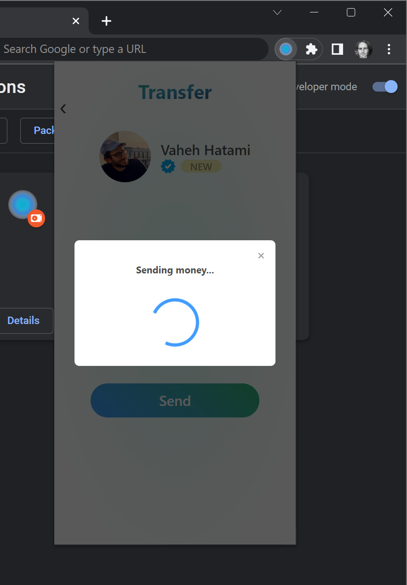
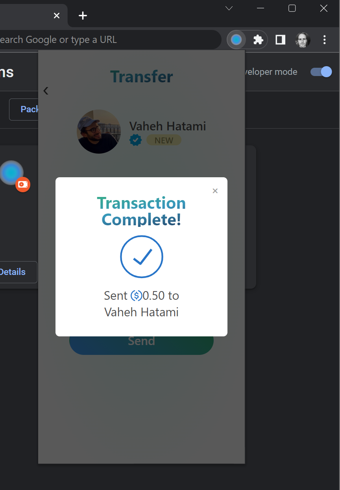

- If someone doesn't have the required Portal Token, say Kevin Rose `3ikkFnEDBvUXPHfCmvXma4qBGZxMooveQ5eM6LLQgeuQ` you can either invite them to get verified, or send them money anyway.
