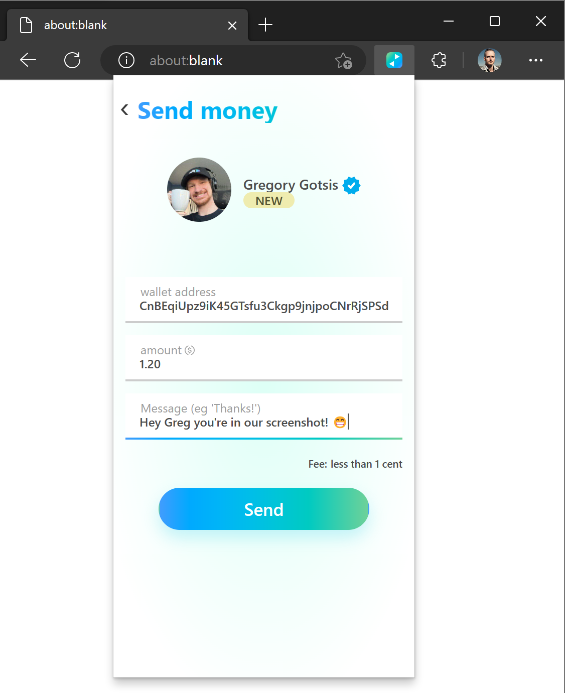
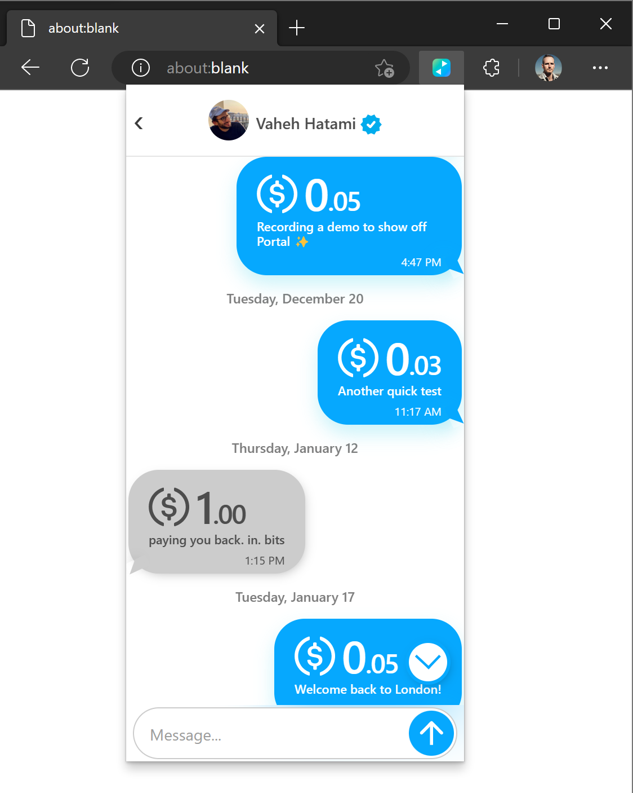
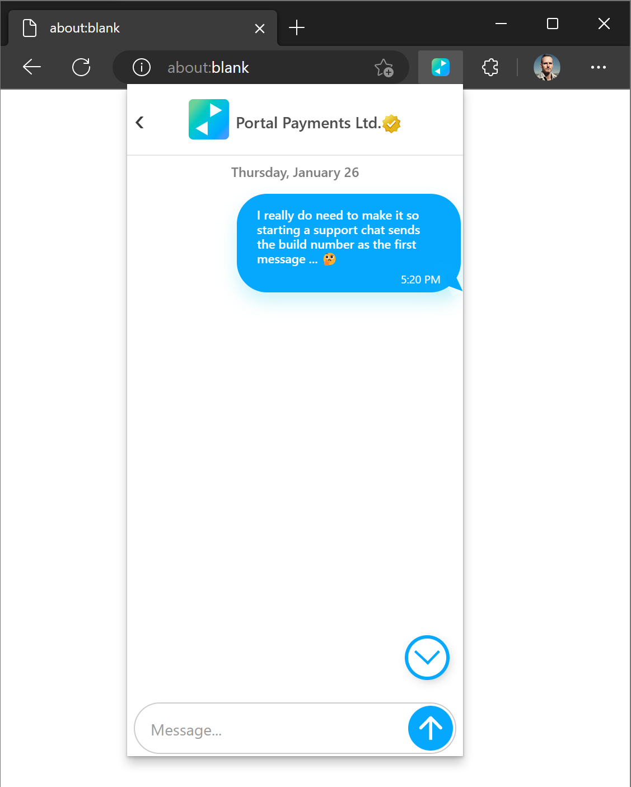
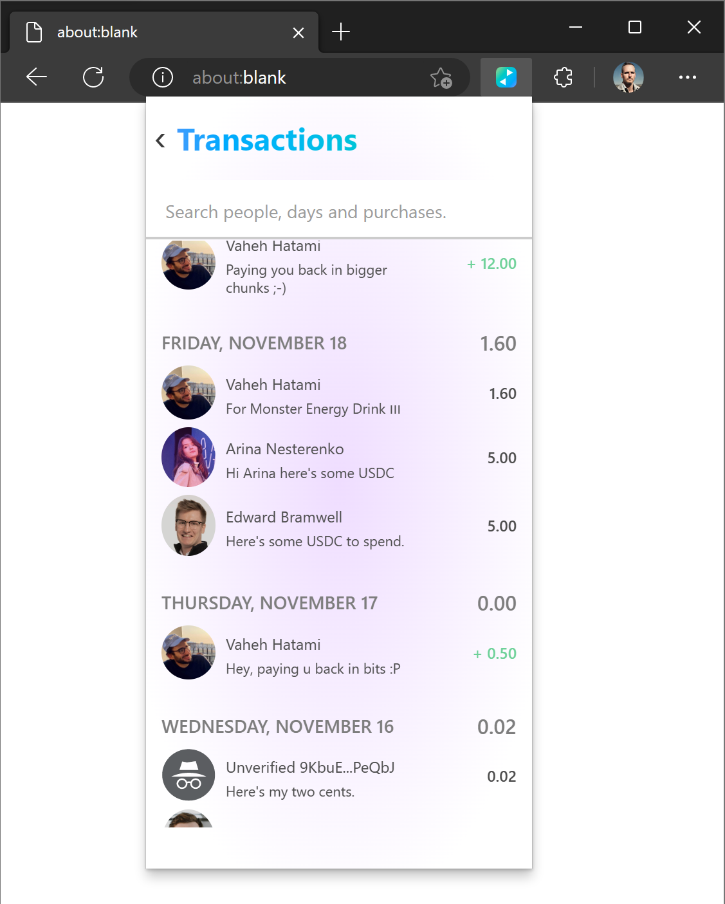
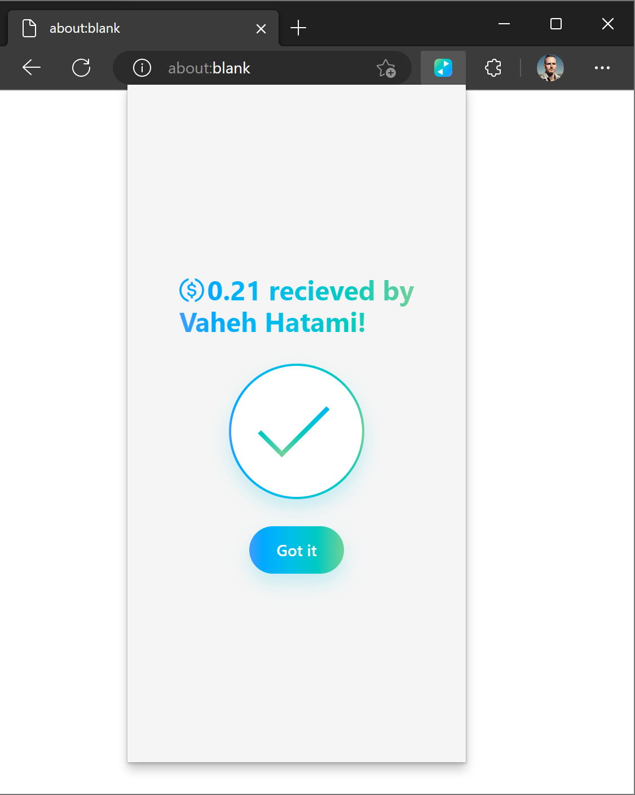

# Portal Wallet

Portal is a DeFi wallet with a built-in real-human identity layer that makes using Solana similar to traditional payment apps. 

[](https://github.com/portalwallet/portalwallet/actions)

## Verified recipients through Portal’s Identity Token

Portal’s payment flow uses real-human identity verification to allow senders to have complete confidence about who will receive their money before they hit the ‘Send’ button.



## Wallet-To-Wallet Messaging

Portal uses Dialect to offer wallet-to-wallet messaging and p2p payments through a single chat-like interface. Right now people typically switch between crypto wallets and other apps, which means users have to make sure the people involved, and the amounts discussed, remain the same. Putting payments and messaging together means Portal’s users can communicate with their contacts before and after sending and recieving money. 



Additionally, Portal uses the integrated chat feature to offer customer support to its users right from within the Portal app. Users can contact the Portal support team from the settings page.



## Human Readable and Searchable Transaction History
Portal has a human readable bank-like transaction history, with recipient names and transaction notes. It also allows the users to search through the history, find a specific transaction, an array of transactions or a receipt.



## Ultrafast Transactions

Portal makes use of Solana's recent update, transaction priority fees, to enable ultrafast transactions. Currently, the average transaction on Portal takes about 2 seconds to go through. 



## Portal is For Everyone
Portal is a wallet with a strong focus on transfers and payments, and is built to be used by everyone.


# Development

Portal uses current generation web tech. 

 - The frontend is built using **Svelte** and **TypeScript**. See `src`.

 - Frontend components (`.svelte`) files are for display purposes only - most of the data is sorted, processed, filtered etc. on the 'backend for the frontend' stored in the `/src/backend` directory. The files in the `src/backend` directory do not involve the browser UI (DOM) at all, but are rather pure TypeScript, that can be iterated and tested on without using a browser.

 - The backend is, or course, the Solana blockchain.

 - Data is stored in **Svelte stores**, see `stores.ts`, where it can be accessed directly from any component that needs them without having to pass properties around. The Svelte store is the source of truth.

 - Some common concepts (see `types.ts`):
  - `AccountSummary` - an account (either for Sol, or an Associated Token account), and the transactions. Each user has a `NativeAccountSummary` (for Sol) and a list of `TokenAccountSummaries`.
  - `TransactionSummary` - a Solana `ParsedTransactionWithMeta` turned into a quick summary of who did what to who.
  - `Contact` - someone that owns a wallet, potentially with `VerifiedClaims` showing who they are, based on Portal identity Token.
 
 - A serviceworker is used for caching when running as a browser extension. This allows Portal to now have to fetch transaction information, account information etc from Solana each time the extension is clicked. Functions in the **store** will often check the serviceworker for cached data - if there's nothing in the cache, we'l ask Solana. Service workers in modern Chrome extensions don't actually run persistently - they're shut down after a little while. So the service worker often saves things to local storage, using the popular `LocalForage` library. Since service workers aren't persistent, it may be better to move saving data into the `stores.ts` and thus remove sending messages between the service worker and store at the expense of multithreading - we'll have to see! Also note re: service workers - we currently don't use vite, https://crxjs.dev/ seems to be the best way to build service workers with vite, but has issues https://github.com/crxjs/chrome-extension-tools/issues/617
 
See [coding guidelines](CODING_GUIDELINES.md).


## To package the Web Extension 

### Make zip file

```
npm run make-zip-file
```

## For browser work

### Install packages

`npm i`

### Start the development server

`npm run dev`

## To test the Web Extension

```
npm run build
```

Then in Chrome / Edge etc, click **manage Extensions**, turn on **Developer Mode**, **Load unpacked** and pick the `dist` folder.

## For tests

You'll need an `.env` file. Ask your colleagues for a copy of this file (not checked into GitHub for security reasons).

Install [a local validator](https://solanacookbook.com/references/local-development.html#starting-a-local-validator):

```

sh -c "$(curl -sSfL https://release.solana.com/stable/install)"
export PATH="~/.local/share/solana/install/active_release/bin:$PATH"

```

Then run:

```

npm run start-validator

```

## How to save Token Metadata & Memo programs for use on localhost

From https://solanacookbook.com/references/local-development.html#how-to-load-accounts-from-mainnet
and https://solana.stackexchange.com/questions/1879/metaplex-create-fails-on-localhost-with-attempt-to-load-a-program-that-does-n/1887#1887

```
npm run update-on-chain-programs
```

## Quick reminder of all Solana Accounts

https://whitepaper.metaplex.com/whitepaper.pdf

 - Wallet account: me
 - Associated token account: my account for this token
 - Mint account: where thi token is minted (controls supply)
 - For NFTs: metadata account (Creators, Collection, etc.)
 - For NFTs: Off chain metadata (traits)

Standards for off chain metadata are at: https://docs.metaplex.com/programs/token-metadata/token-standard#the-non-fungible-standard
