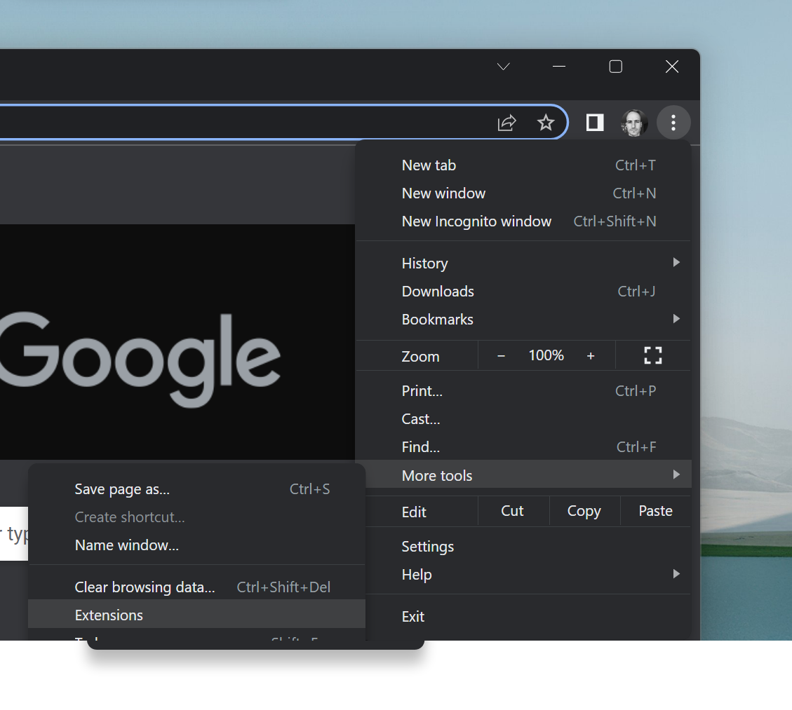
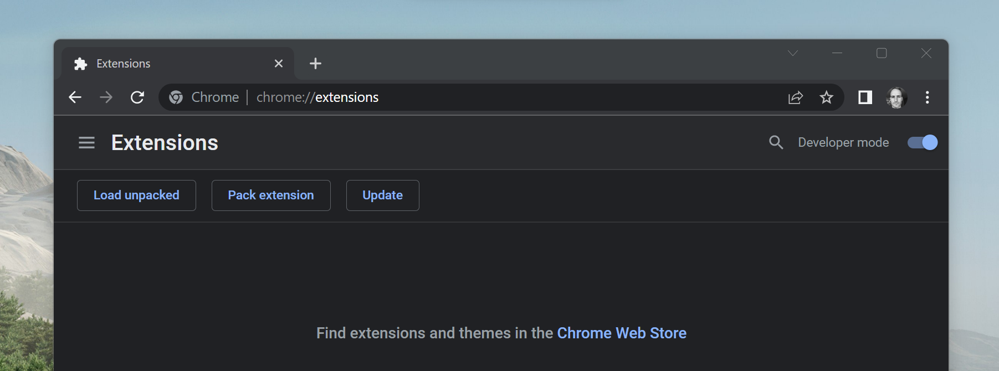

# Portal Wallet - YCombinator Demo

Hi YCombinator! We've made a quick demo of Portal for you. 

**You can use this to send real money to identified recipients anywhere in the world instantly.**

## Installing the extension

Normally Portal is installed through the Chrome Web Store (or Edge Web Store etc). But for this demo we'll install it the old fashioned way.

Download an unzip the the file provided. 

Then in Chrome, click the three dot menu then **Manage Extensions**:



Turn on **Developer Mode**


Now click **Load unpacked extension**



Select the folder:


Now the extension is loaded:


Now click the puzzle piece 🧩 icon and Pin the Portal wallet:


You can now open Portal:

## Sending money
 
We have made a demo wallet for Jared Friedman that's already signed in and verified. Normally, users go through a regular Jumio / Onfido government-supplied ID check as part of signup, to get verified, we've saved you the time for this demo! 

The account has $5.00 real USDC, and you can send the money anywhere you want. 

 - To see what sending money looks like, try sending to the address `6PCANXw778iMrBzLUVK4c9q6Xc2X9oRUCvLoa4tfsLWG` - your friend Vaheh says this is their Solana account. Let's find out if this is true! 

You can send USDC to Vaheh's wallet, and know it's really him, entirely on the block chain. 

 - If someone doesn't have a the required Portal Token, say `` you can either invite them to get verified, or send them money anyway.

## 
Then in your browser DevTools console run:

```
localStorage.setItem("PORTAL_PRIVATE_KEY", "1234567890123456789012345678901234567890123456789012345678901234567890123456789012345678")
```

## Delete me

[5:27 pm, 08/09/2022] Mike MacCana: OK next steps LMK what you think:

 - Make a wallet for 'Jared Friedman' 
 - Put some money in the wallet
 - Make a token for Jared Friedman with his firstname, lastname, a plain-ish picture etc.
 - Make a zip file
 - Write some instructions
 - Test the instructions

* BTW if it's not obvious, .crx files are just zip files with a different extensions, .docx files are zip files too.
[5:30 pm, 08/09/2022] Mike MacCana: + I will hack the one in the zip file to automatically set the private key in localStorage so they don't need to open the console
[5:54 pm, 08/09/2022] Mike MacCana: I might also use a minified build
